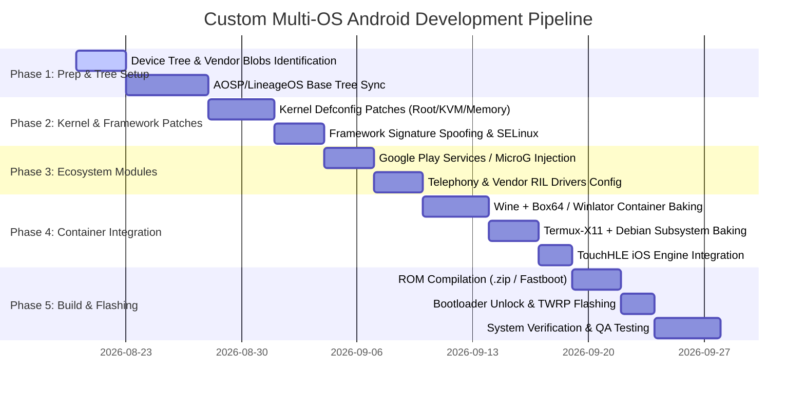

# Master Project Roadmap & Development Pipeline

This document outlines the end-to-end milestone roadmap for developing, compiling, testing, and flashing the **Custom Multi-OS Android System**.

---

## Roadmap Overview

---

## Detailed Milestone Objectives

### Milestone 1: Environment & Device Tree Configuration
- **Task 1.1**: Obtain physical phone details (Brand, Exact Model, Chipset, Device Codename).
- **Task 1.2**: Set up AOSP / LineageOS source tree workspace on build host.
- **Task 1.3**: Sync device trees, kernel repositories, and vendor proprietary binary blobs (`extract-files.sh`).

### Milestone 2: Security & Framework Patches
- **Task 2.1**: Apply signature spoofing patch to `frameworks/base/core/res`.
- **Task 2.2**: Integrate `su` binary in `/system/xbin/su` and root superuser management daemon.
- **Task 2.3**: Configure kernel `defconfig` for permissive SELinux, eBPF packet inspection, and Box64 virtual memory requirements.

### Milestone 3: Daily Driver Ecosystem & Telephony
- **Task 3.1**: Inject MicroG GmsCore + GsfProxy + Store into `/system/priv-app`.
- **Task 3.2**: Configure vendor RIL radio daemon for dual SIM voice calling, SMS, VoLTE, and mobile data.
- **Task 3.3**: Pass Play Integrity / SafetyNet basic attestation for banking apps.

### Milestone 4: Multi-OS Engine Pre-integration
- **Task 4.1**: Bake Winlator (Wine 9.x + Box64 + DXVK) into system launcher.
- **Task 4.2**: Bake Termux-X11 + Debian Linux desktop rootfs.
- **Task 4.3**: Integrate TouchHLE Mach-O iOS binary translator and Web PWA bridge.

### Milestone 5: Build Compilation, Release & Flashing
- **Task 5.1**: Compile flashable zip (`make bacon` / `make target_files_package`).
- **Task 5.2**: Create GitHub release with `.zip` package and checksums.
- **Task 5.3**: Backup EFS partition and flash custom ROM onto target phone via TWRP recovery.
- **Task 5.4**: Perform QA testing across all 4 OS ecosystems.
