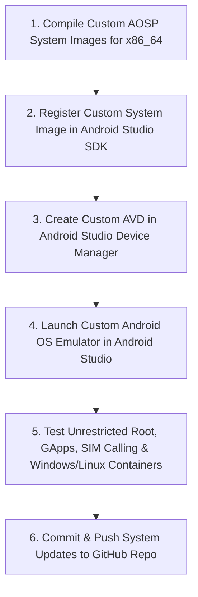

# Master Custom Android OS Implementation & Architecture Plan

This master document consolidates all iterations and versions of the implementation plan (v1 through v4) for building the **Custom Multi-OS Android System**.

---

## Table of Contents
1. [Version 1: Core System Architecture & Initial Blueprint](#version-1-core-system-architecture--initial-blueprint)
2. [Version 2: Multi-OS Daily Driver Ecosystem Integration](#version-2-multi-os-daily-driver-ecosystem-integration)
3. [Version 3: Physical Phone Custom ROM Target](#version-3-physical-phone-custom-rom-target)
4. [Version 4: Android Studio Emulator (AVD) Target](#version-4-android-studio-emulator-avd-target)
5. [Current Execution Status & Modular Addendum](#current-execution-status--modular-addendum)

---

## Version 1: Core System Architecture & Initial Blueprint

This initial plan outlines the core architecture, setup, and roadmap for building/customizing a specialized **Android OS** designed for:
1. **Unrestricted Developer & Security Testing**: Root access, disabled/relaxed system restrictions, custom SELinux rules, signature spoofing, and low-level debugging capabilities.
2. **Daily Driver Usability**: Full Google Ecosystem support (Play Store, Play Services, GApps/MicroG), Telephony & Calling integration.
3. **Cross-Platform Compatibility**:
   - **Windows Apps (.exe)**: Executing x86/x64 Windows binaries via a Wine + Box64 translation layer (e.g. Winlator / Mobox / Box64 container).
   - **iOS Apps (.ipa)**: Technical analysis, lightweight ARM/iOS translation (TouchHLE for legacy apps, web containers, or cloud streaming for modern iOS binaries).

### Target Deployment Platform Choice
1. **Physical Smartphone (Custom ROM / AOSP Port)**: Built for a specific ARM64 device (e.g., Pixel, Xiaomi, OnePlus). Gives native hardware performance, camera, SIM calling, and sensor access.
2. **PC / Virtual Machine / Dual Boot (x86_64 Android OS)**: Built based on Android-x86 / BlissOS / Waydroid. Runs on PC with GPU acceleration, ideal for heavy testing and running Windows apps smoothly.
3. **Custom Emulator / Android Virtual Device (AVD)**: Built as a custom system image for Android Studio / QEMU emulator. Safest for deep system debugging without bricking physical hardware.

### Technical Feasibility of Running iOS (.ipa) Apps on Android
- iOS app binaries run on Apple's closed-source **Darwin/XNU kernel** and proprietary **Cocoa Touch / Metal APIs**.
- **Supported workarounds**:
  1. **TouchHLE**: Runs older 32-bit iOS games/apps (iOS 2.x - 3.x era).
  2. **Web / PWA Versions**: Many popular iOS apps (Social, Utility, Productivity) have web equivalents that run seamlessly.
  3. **Cloud iOS Instances**: Streaming an interactive iOS instance (e.g. Appetize.io) inside an Android web container.

### System Architecture Blueprint
```mermaid
flowchart TD
    subgraph Core OS Layer
        AOSP[AOSP Core / Android Kernel]
        SU[Root Access / APatch / Magisk]
        SE[Permissive / Custom SELinux]
        SIG[Signature Spoofing Module]
    end

    subgraph Google & Communication Layer
        GApps[Google Play Services / MicroG]
        PlayStore[Google Play Store / Aurora Store]
        Telecom[Telephony Subsystem & RIL / Calling API]
    end

    subgraph Cross-Platform Execution Layer
        WinLayer[Winlator / Wine + Box64 (Windows .exe)]
        iOSLayer[TouchHLE / Web PWA Bridge (iOS apps)]
    end

    AOSP --> SU
    AOSP --> SE
    AOSP --> SIG
    AOSP --> GApps
    GApps --> PlayStore
    AOSP --> Telecom
    AOSP --> WinLayer
    AOSP --> iOSLayer
```

---

## Version 2: Multi-OS Daily Driver Ecosystem Integration

This section expands the architecture to include full **Linux, Windows, and iOS/Apple ecosystem daily driver integration** alongside Google Play Services and restriction-free developer testing.

### Ecosystem Integration Overview

| Ecosystem | Integration Architecture | Daily Driver Capabilities |
| :--- | :--- | :--- |
| **Google** | MicroG / Play Services + GApps | Play Store, Google Maps, YouTube, Sync, Push Notifications |
| **Linux** | Termux-X11 + Debian/Ubuntu Chroot | Terminal, Bash/Zsh, Python, Node, VS Code, Desktop GUI |
| **Windows** | Wine + Box64 / Winlator Container | `.exe` software execution, x86/x86_64 translation, DirectX/OpenGL |
| **iOS / Apple** | TouchHLE + Web PWA / iCloud Bridge | iOS 32-bit binaries, iCloud Services, Web PWAs, Cloud iOS preview |
| **Telephony** | Android Telecom Subsystem & Vendor RIL | SIM Phone calls, SMS, Dialer, VoIP/SIP calling |

### Expanded Multi-OS System Architecture
```mermaid
flowchart TD
    subgraph Core OS & Dev Layer
        AOSP[AOSP Core / Android Kernel]
        SU[Root Access / APatch / Magisk]
        SE[Permissive / Custom SELinux]
        SIG[Signature Spoofing Module]
        FRIDA[Frida & SSL Pinning Bypass]
    end

    subgraph Multi-Ecosystem Daily Driver Layer
        GApps[Google Play Services & Store]
        LinuxSub[Linux Subsystem (Debian/Ubuntu + X11)]
        WinSub[Windows Container (Wine + Box64)]
        iOSSub[iOS Container (TouchHLE + PWA Bridge)]
        Telecom[Telephony / SIM RIL & Calling API]
    end

    AOSP --> SU
    AOSP --> SE
    AOSP --> SIG
    AOSP --> FRIDA
    AOSP --> GApps
    AOSP --> LinuxSub
    AOSP --> WinSub
    AOSP --> iOSSub
    AOSP --> Telecom
```

---

## Version 3: Physical Phone Custom ROM Target

This section focuses specifically on building a **Custom Android OS ROM (.zip)** designed to be flashed onto a **Physical Smartphone** after repair.

### Target Objective
Take a physical smartphone, compile a custom AOSP / LineageOS based system image patched with:
1. **Unrestricted Developer Tools**: Root access (`su`), relaxed SELinux, signature spoofing, and Frida/SSL pinning bypass.
2. **Native Daily Driver Telephony**: Hardware vendor RIL drivers for SIM calling, SMS, VoLTE, and mobile data.
3. **Pre-baked Google Ecosystem**: MicroG / GApps + Google Play Store integration.
4. **Embedded Multi-OS Containers**:
   - **Winlator (Wine + Box64)** pre-configured to run Windows `.exe` apps.
   - **Termux-X11 + Debian** pre-configured for Linux desktop.
   - **TouchHLE + PWA Bridge** pre-configured for iOS apps/services.

### Roadmap for Physical Phone
```mermaid
flowchart TD
    Step1[1. Identify Target Phone Model & Device Tree] --> Step2[2. Setup AOSP/LineageOS Build Source Tree]
    Step2 --> Step3[3. Patch Kernel & Framework: Root, SELinux, Signature Spoofing]
    Step3 --> Step4[4. Inject Google Apps, MicroG & Telephony RIL Drivers]
    Step4 --> Step5[5. Bake-in Multi-OS Engines: Winlator, Linux X11, TouchHLE]
    Step5 --> Step6[6. Compile Custom Flashable ROM (.zip / fastboot images)]
    Step6 --> Step7[7. Unlock Bootloader & Flash onto Phone via Recovery/Fastboot]
```

---

## Version 4: Android Studio Emulator (AVD) Target

This section outlines the build target and testing workflow for running the **Custom Multi-OS Android System** directly inside **Android Studio Emulator (AVD / QEMU)**.

### Target Build Configuration
- **Target Architecture**: `x86_64`.
- **Target Product**: `aosp_x86_64-userdebug`.
- **System Image Outputs**:
  - `system.img` (Patched AOSP framework + Root + GApps/MicroG)
  - `vendor.img` (Emulator drivers & OpenGL/Vulkan rendering)
  - `ramdisk.img` (Root ramdisk & init scripts)
  - `kernel-ranchu` (Custom Linux kernel with KVM, eBPF & Box64 support)

### Emulator Workflow


---

## Current Execution Status & Modular Addendum

### Update Log (August 2026):
1. **Target Product**: Selected `aosp_x86_64-userdebug` (100% open-source AOSP x86_64 target for Android Studio Emulator).
2. **Workspace Location**: `E:\android\aosp` (`/mnt/e/android/aosp` in WSL2).
3. **Patches Applied**: `frameworks_base_signature_spoofing.patch`, `su_root_integration.mk`, `kernel_multi_os_defconfig.config`.
4. **Modules Registered**: `modules/microg`, `modules/winlator`, `modules/termux_x11`, `modules/touchhle` copied to `/vendor/extra/packages/`.
5. **Selective Sync Dependencies**: Synced missing `clang/host/linux-x86`, `vndk/v29-v33`, `hardware/interfaces`, `system/libhidl`, `system/apex`, `system/bpf`, `system/extras`, `tools/tradefederation`, `prebuilts/rust`, `cts`, `sdk`, `prebuilts/sdk`.
6. **Active Build Command**: `m systemimage vendorimage ramdisk -j2` executing in `/mnt/e/android/aosp`.
