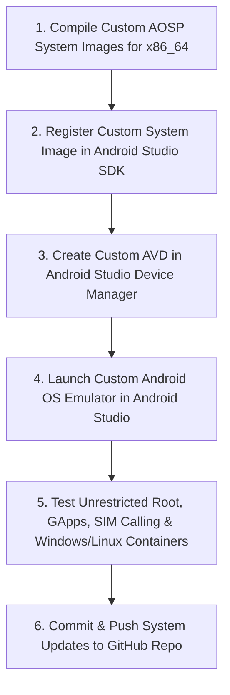

# Custom Android OS Plan (v4 - Android Studio Emulator Target)

This plan outlines the architecture, build target, and testing workflow for running the **Custom Multi-OS Android System** directly inside **Android Studio Emulator (AVD / QEMU)**.

---

## Why Android Studio Emulator is Ideal for Initial Testing

1. **Zero Hardware Risk**: Test root permissions, custom system partitions, and kernel patches without any risk of bricking a physical device.
2. **Native PC Hardware Speed**: Running an x86_64 custom Android image on your PC CPU allows Windows `.exe` apps and Linux containers to run with high performance.
3. **Simulated Telephony & Sensors**: Android Studio's Emulator Extended Controls allow full testing of incoming/outgoing phone calls, SMS, cellular network states, and location mock without needing a real SIM card.

---

## Target Build Configuration

- **Target Architecture**: `x86_64` (or `arm64-v8a` if running on Apple Silicon / ARM PC).
- **Target Combo**: `aosp_x86_64-userdebug` or `sdk_gphone64_x86_64-userdebug`.
- **System Image Outputs**:
  - `system.img` (Patched AOSP framework + Root + GApps/MicroG)
  - `vendor.img` (Emulator drivers & OpenGL/Vulkan rendering)
  - `ramdisk.img` (Root ramdisk & init scripts)
  - `kernel-ranchu` (Custom Linux kernel with KVM, eBPF & Box64 support)

---

## Development & Testing Workflow

---

## Milestone Execution

### Phase 1: Custom Emulator System Image Build
- Configure `aosp_x86_64-userdebug` source tree.
- Apply signature spoofing, `su` root binary, and SELinux patches to system image.

### Phase 2: Android Studio Integration
- Copy generated `system.img` into Android Studio SDK `system-images/android-34/google_apis/x86_64/` directory.
- Create an AVD using Android Studio's Virtual Device Manager.

### Phase 3: Telephony & Multi-OS Container Testing
- Test incoming/outgoing phone calls via Android Studio Emulator Extended Controls panel (`ADB dialer / telephony`).
- Test pre-installed Winlator, Termux-X11, and TouchHLE containers inside the emulator.
